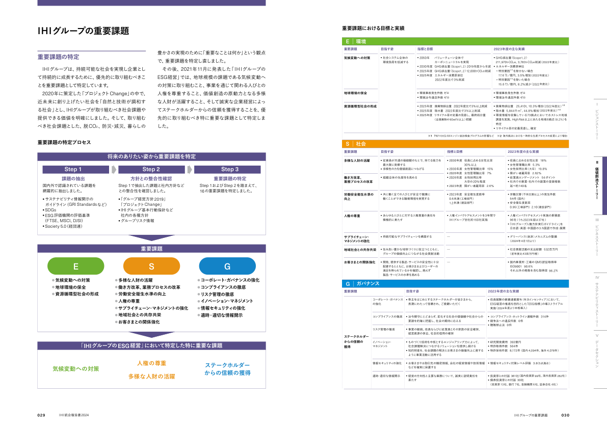

# Azure AI Document intelligence

>https://azure.microsoft.com/ja-jp/products/ai-services/ai-document-intelligence

ドキュメント（PDF）の前処理（Markdown化）に使用する．

2024/12に更新された最新の事前構築済レイアウトモデル `prebuilt-layout` を使用する（使用できるリージョンに限りがあることに注意）．
>https://learn.microsoft.com/ja-jp/azure/ai-services/document-intelligence/prebuilt/layout?view=doc-intel-4.0.0&tabs=sample-code

レイアウトモデルの構造解析結果については，以下の記事が詳しい．
>https://qiita.com/nohanaga/items/1263f4a6bc909b6524c8

## 事前準備
Azure のサブスクリプションを取得の上，以下の手順でインスタンスを作成する．詳細は公式リファレンス等を参照する．いずれもリージョンに注意する．
 1. Azure AI services のリソースを作成する
 2. Document intelligence のインスタンスを作成しAPIキーおよびエンドポイントを取得する

## 検証結果

RAGの検索対象であったPDFファイルの以下1ページを例として簡単にまとめる．



画像の通り，このページは以下の特徴があり，直近の生成AIを使っても構造解析は厳しかった．
- 区画が不規則
- 非構造なデータ（ex. 左下のフロー図）を含む
- 表（セル結合あり）を含む
- フッターが存在する（ノイズの原因）

以下，Document intelligence の構造解析結果を含め，いくつかの手法で比較した結果を記載する．

### 純粋なテキスト抽出
PDFからテキストを抽出するライブラリは数多く存在する．ここでは`PyMuPDF` による抽出結果のみ示す．  
元画像と比較すると，特にフロー図や表はこのままではRAGに使用できないことは感覚的に分かる．  

<details>
<summary>PyMuPDFによるテキスト抽出結果</summary>

```
IHI 統合報告書2024
 Ⅰ
　
ビ
ジ
ョ
ン
ス
ト
ー
リ
ー
  
 
 
 
 ⅠⅠ
　
価
値
創
造
ス
ト
ー
リ
ー
 
 
   
　
 ⅠⅠⅠ
　
ビ
ジ
ネ
ス
ス
ト
ー
リ
ー
  
    
　
 
 ⅠV
　
サ
ス
テ
ナ
ビ
リ
テ
ィ
ス
ト
ー
リ
ー
  
　
 
 V
　
デ
ー
タ
セ
ク
シ
ョ
ン
030
029
IHIグループの重要課題
重要課題の特定
 IHIグループは、持続可能な社会を実現し企業とし
て持続的に成長するために、優先的に取り組むべきこ
とを重要課題として特定しています。
 2020年に策定した「プロジェクトChange」の中で、
近未来に創り上げたい社会を「自然と技術が調和す
る社会」とし、IHIグループが取り組むべき社会課題や
提供できる価値を明確にしました。そして、取り組む
べき社会課題とした、脱CO2、防災・減災、暮らしの
豊かさの実現のために「重要なことは何か」という観点
で、重要課題を特定し直しました。
 その後、2021年11月に発表した「IHIグループの
ESG経営」では、地球規模の課題である気候変動へ
の対策に取り組むこと、事業を通じて関わる人びとの
人権を尊重すること、価値創造の原動力となる多様
な人財が活躍すること、そして誠実な企業経営によっ
てステークホルダーからの信頼を獲得することを、優
先的に取り組むべき特に重要な課題として特定しま
した。
気候変動への対策
地球環境の保全
資源循環型社会の形成
● 2050年   　バリューチェーン全体で
   
 
    カーボンニュートラルを実現
● 2030年度   GHG排出量（Scope1, 2） 2019年度から半減
● 2025年度   GHG排出量（Scope1, 2） 12,000t-CO2e削減
● 2025年度   エネルギー消費原単位   
   
 
    2022年度比で3%削減
● 環境事故発生件数 ゼロ
● 環境法令違反件数 ゼロ
● 2025年度   廃棄物排出量   2022年度比で3%以上削減
● 2025年度   取水量   2022年度比で3％以上削減
● 2025年度    リサイクル率の定義の見直し、最終処分量
   
 
    （全廃棄物の90wt％以上）把握
● GHG排出量（Scope1, 2）　
 211,970t-CO2e、3,783t-CO2e削減（2022年度比） 
● エネルギー消費原単位
  ▶ 特別要因
※1を除かない場合　
  17.6 TJ／億円、3.5%増加（2022年度比）
  ▶ 特別要因
※1を除いた場合　　
  15.6 TJ／億円、8.2%減少（2022年度比）
● 環境事故発生件数 ゼロ
● 環境法令違反件数 ゼロ
● 廃棄物排出量　25,410t、10.3%増加（2022年度比）
※2
● 取水量  5,844千m3、44.8%増加（2022年度比）
※2
● 環境情報を収集している73拠点において水ストレス地域
調査を実施、High Risk以上にあたる地域6拠点（8.2％）を
特定
● リサイクル率の定義見直し、確定
ステークホルダー
からの信頼の
獲得
※1   PW1100G-JMエンジン追加検査プログラムの影響など 　※2  海外拠点における一時的な生産プロセスの変更により増加
多様な人財の活躍
働き方改革、
業務プロセスの改革 
労働安全衛生水準の
向上
人権の尊重
サプライチェーン・
マネジメントの強化
地域社会との共存共栄
お客さまとの関係強化
● 従業員が共通の価値観のもとで、持てる能力を
 最大限に発揮する
● 多様性の力を価値創造につなげる
● 組織全体の生産性を高める
● 共に働く全ての人びとが安全で健康に
 働くことができる職場環境を実現する
● あらゆる人びとに対する人権尊重の責任を
 積極的に果たす
● 持続可能なサプライチェーンを構築する
● 住み良い豊かな地球づくりに役立つとともに、
 グループの価値向上につながる社会貢献活動
● 開発、提供する製品・サービスの安全性に十分
 配慮するとともに、お客さまおよびユーザーの
 満足を得られているかを確認し、絶えず
 製品・サービスの水準を高める
● 2030年度   役員に占める女性比率　
   
 
    30%以上
● 2030年度   女性管理職比率   15%
● 2026年度   女性管理職比率   7%
● 2026年度   女性採用比率　
   
 
    大卒の20%程度
● 2023年度   障がい者雇用率   2.6%
● 2023年度   安全衛生度数率　
 0.6未満（工場部門） 
 1.2未満（建設部門）
● 人権インパクトアセスメントを3年間で
 IHIグループ会社約160社実施
̶
̶
̶
● 役員に占める女性比率   18%
● 女性管理職比率   5.3%
● 女性採用比率（大卒）   19.8%
● 障がい者雇用率   2.62%
● 従業員エンゲージメント   54ポイント
● 社外での兼業・社内での副業の登録者数　
 延べ約140名 
● 労働災害（不休災害以上）の発生件数
 54件（国内）
● 安全衛生度数率　
 0.95（工場部門）  2.10（建設部門）
● 人権インパクトアセスメント実施の累積数
 96社（うち2023年度は37社）
● 「IHIグループ人権方針実行ガイドライン」を
 日本語・英語・中国語の3カ国語で作成・展開
● グリーバンス（救済）メカニズムの整備
 （2024年4月1日より）
● 社会貢献活動の支出総額   532百万円
 （前年度比43百万円増）
● 国内事業所・工場のQMS認証取得率
 ISO9001   90.6％
 それ以外の規格を含む取得率  96.2％
コーポレート・ガバナンス
の強化
コンプライアンスの徹底
リスク管理の徹底 
イノベーション・
マネジメント
情報セキュリティの強化
適時・適切な情報開示
● 株主をはじめとするステークホルダーの皆さまから、
 長期にわたって信頼され、ご愛顧いただく
● 法令順守にとどまらず、変化する社会の価値観や社会からの
 要請を的確に把握し、社会の期待に応える
● 事業の継続、役員ならびに従業員とその家族の安全確保、
 経営資源の保全、社会的信用の確保
● ものづくり技術を中核とするエンジニアリング力によって、
 社会課題解決につながるソリューションを提供し続ける
● 知的財産を、社会課題の解決とお客さまの価値向上に資する
 ように事業活動に活用する
● お客さまやお取引先の機密情報、会社の経営情報や技術情報
 などを確実に保護する
● 経営の方向性と主要な業務について、誠実に説明責任を
 果たす
● 役員報酬の業績連動賞与（年次インセンティブ）において、
 ESG経営の推進を目的とした「ESG指標」の導入トライアル
 実施（2024年度より本格導入）
● コンプライアンス・ホットライン通報件数   314件
● 競争法への違反件数   0件　
● 贈賄禁止法   0件 
● 研究開発費用   393億円　
● 特許取得件数   564件
● 特許保有件数   8,172件 （国内 4,094件、海外 4,078件）
● 情報セキュリティ対策レベル評価   3.8（5点満点）
● 投資家との対話  361社（国内投資家 99社、海外投資家 262社）
● 債券投資家との対話  30社
 （投資家 13社、銀行 7社、金融機関 6社、証券会社 4社）
重要課題
目指す姿
指標と目標
2023年度の主な実績
重要課題
目指す姿
指標と目標
2023年度の主な実績
重要課題
目指す姿
2023年度の主な実績
E｜環境
S｜社会
G｜ガバナンス
重要課題における目標と実績
● 社会システム全体の
 環境負荷を低減する
将来のありたい姿から重要課題を特定
重要課題
課題の抽出
方針との整合性確認
重要課題の特定
Step 1
Step 2
Step 3
気候変動への対策
人権の尊重
多様な人財の活躍
ステークホルダー
からの信頼の獲得
● 気候変動への対策
● 地球環境の保全
● 資源循環型社会の形成
● 多様な人財の活躍
● 働き方改革、業務プロセスの改革
● 労働安全衛生水準の向上
● 人権の尊重
 ●  サプライチェーン・マネジメントの強化
● 地域社会との共存共栄
 ●  お客さまとの関係強化
● コーポレート・ガバナンスの強化
● コンプライアンスの徹底
● リスク管理の徹底
● イノベーション・マネジメント
● 情報セキュリティの強化
● 適時・適切な情報開示
国内外で認識されている課題を
網羅的に抽出しました。
●  サステナビリティ情報開示の
   ガイドライン（GRI Standardsなど）
●  SDGs
●  ESG評価機関の評価基準
  （FTSE、MSCI、DJSI）
●  Society 5.0（経団連）
Step 1で抽出した課題と社内方針など
との整合性を確認しました。
●  「グループ経営方針2019」
  「プロジェクトChange」
●  IHIグループ基本行動指針など
  社内の各種方針
●  グループリスク情報
Step 1およびStep 2を踏まえて、
16の重要課題を特定しました。
E
S
G
「IHIグループのESG経営」において特定した特に重要な課題
重要課題の特定プロセス
IHIグループの重要課題
```
</details>

### 主要LLM

以下マルチモーダル LLM の API を実行しドキュメント（ PDF，および画像化した PNG ）をインプットにテキスト化を試みた．
 - `gpt-4o`（OpenAI）
 - `gpt-4o-mini`（OpenAI）
 - `claude-3-5-sonnet-20241022`（Anthropic）

テキスト化の精度は以下（プロンプトにも依るはずなので，あくまで手元の所感）

`claude-3-5-sonnet-20241022` ≒ `gpt-4o-mini` < `gpt-4o`

ここでは `gpt-4o` による抽出結果のみ示す．  
一見，Markdownによる構造化や表の作成など，それなりにテキスト化できているように見えるが，元画像と比較すれば分かる通り，誤ったテキスト化が含まれハルシネーションの原因となる可能性がある．

<details>
<summary>gpt-4o によるテキスト抽出結果</summary>

```
# IHIグループの重要課題

##### 重要課題の特定


###### 豊かさの実現のために「重要なことは何か」という観点

 で、重要課題を特定し直しました。


###### 重要課題における目標と実績


###### E｜環境


**重要課題** **目指す姿** **指標と目標** 2023年度の主な実績


- GHG排出量（Scope1, 2）
211,970t-CO2e、3,783t-CO2e削減（2022年度比）

- エネルギー消費原単位

[▶] 特別要因※1を除かない場合
17.6 TJ／億円、3.5% 増加（2022年度比）

[▶] 特別要因※1を除いた場合
15.6 TJ／億円、8.2% 減少（2022年度比）


###### IHIグループは、持続可能な社会を実現し企業とし

 て持続的に成長するために、優先的に取り組むべきこ

 とを重要課題として特定しています。


**気候変動への対策**

**地球環境の保全**

|目指す姿|指標と目標|
|---|---|
|● 社会システム全体の 環境負荷を低減する|● 2050年 バリューチェーン全体で カーボンニュートラルを実現 ● 2030年度 GHG排出量（Scope1, 2） 2019年度から半減 ● 2025年度 GHG排出量（Scope1, 2） 12,000t-CO2e削減 ● 2025年度 エネルギー消費原単位 2022年度比で3%削減|
||● 環境事故発生件数 ゼロ ● 環境法令違反件数 ゼロ|


                             - リサイクル率の定義見直し、確定

**※1  PW1100G-JMエンジン追加検査プログラムの影響など** **※2 海外拠点における一時的な生産プロセスの変更により増加**


###### 2020年に策定した「プロジェクトChange」の中で、

 近未来に創り上げたい社会を「自然と技術が調和す

 る社会」とし、IHIグループが取り組むべき社会課題や

 提供できる価値を明確にしました。そして、取り組む

 べき社会課題とした、脱 CO2 、防災・減災、暮らしの


###### その後、2021年11月に発表した「IHI グループの

 ESG経営」では、地球規模の課題である気候変動へ

 の対策に取り組むこと、事業を通じて関わる人びとの

 人権を尊重すること、価値創造の原動力となる多様

 な人財が活躍すること、そして誠実な企業経営によっ

 てステークホルダーからの信頼を獲得することを、優

 先的に取り組むべき特に重要な課題として特定しま

 した。


- 環境事故発生件数 ゼロ

- 環境法令違反件数 ゼロ

- 廃棄物排出量 25,410t、10.3% 増加（2022年度比）※2

- 取水量 5,844千 m[3] 、44.8% 増加（2022年度比）※2


**資源循環型社会の形成**


- 2025年度 廃棄物排出量  2022年度比で3%以上削減

- 2025年度 取水量  2022年度比で3％以上削減


- 2025年度 リサイクル率の定義の見直し、最終処分量
（全廃棄物の90wt％以上）把握


- 環境情報を収集している73拠点において水ストレス地域

調査を実施、High Risk以上にあたる地域6拠点（8.2％）を


###### Ⅰ

 ⅠⅠ


特定


###### 重要課題の特定プロセス


###### ⅠⅠⅠ

 ⅠV

|S｜社会|Col2|Col3|Col4|
|---|---|---|---|
|重要課題|目指す姿 指標と目標||2023年度の主な実績|
|多様な人財の活躍|● 従業員が共通の価値観のもとで、持てる能力を 最大限に発揮する ● 多様性の力を価値創造につなげる|● 2030年度 役員に占める女性比率 30%以上 ● 2030年度 女性管理職比率 15% ● 2026年度 女性管理職比率 7% ● 2026年度 女性採用比率 大卒の20%程度 ● 2023年度 障がい者雇用率 2.6%|● 役員に占める女性比率 18% ● 女性管理職比率 5.3% ● 女性採用比率（大卒） 19.8% ● 障がい者雇用率 2.62% ● 従業員エンゲージメント 54ポイント ● 社外での兼業・社内での副業の登録者数 延べ約140名|
|働き方改革、 業務プロセスの改革|● 組織全体の生産性を高める|||
|労働安全衛生水準の 向上|● 共に働く全ての人びとが安全で健康に 働くことができる職場環境を実現する|● 2023年度 安全衛生度数率 0.6未満（工場部門） 1.2未満（建設部門）|● 労働災害（不休災害以上）の発生件数 54件（国内） ● 安全衛生度数率 0.95（工場部門） 2.10（建設部門）|
|人権の尊重|● あらゆる人びとに対する人権尊重の責任を 積極的に果たす|● 人権インパクトアセスメントを3年間で IHIグループ会社約160社実施|● 人権インパクトアセスメント実施の累積数 96社（うち2023年度は37社） ●「 IHIグループ人権方針実行ガイドライン」を 日本語・英語・中国語の3カ国語で作成・展開|
|サプライチェーン・ マネジメントの強化|● 持続可能なサプライチェーンを構築する|̶|● グリーバンス（救済）メカニズムの整備 （2024年4月1日より）|
|地域社会との共存共栄|● 住み良い豊かな地球づくりに役立つとともに、 グループの価値向上につながる社会貢献活動|̶|● 社会貢献活動の支出総額 532百万円 （前年度比43百万円増）|
|お客さまとの関係強化|● 開発、提供する製品・サービスの安全性に十分 配慮するとともに、お客さまおよびユーザーの 満足を得られているかを確認し、絶えず 製品・サービスの水準を高める|̶|● 国内事業所・工場のQMS認証取得率 ISO9001 90.6％ それ以外の規格を含む取得率 96.2％|


###### V

|G｜ガバナンス|Col2|Col3|Col4|
|---|---|---|---|
|重要課題 コーポレート・ガバナンス の強化 コンプライアンスの徹底 リスク管理の徹底 ステークホルダー からの信頼の イノベーション・ 獲得 マネジメント 情報セキュリティの強化 適時・適切な情報開示||目指す姿|2023年度の主な実績 ● 役員報酬の業績連動賞与（年次インセンティブ）において、 ESG経営の推進を目的とした「ESG指標」の導入トライアル 実施（2024年度より本格導入） ● コンプライアンス・ホットライン通報件数 314件 ● 競争法への違反件数 0件 ● 贈賄禁止法 0件 ● 研究開発費用 393億円 ● 特許取得件数 564件 ● 特許保有件数 8,172件（ 国内 4,094件、海外 4,078件） ● 情報セキュリティ対策レベル評価 3.8（5点満点） ● 投資家との対話 361社（国内投資家 99社、海外投資家 262社） ● 債券投資家との対話 30社 （投資家 13社、銀行 7社、金融機関 6社、証券会社 4社）|
|||● 株主をはじめとするステークホルダーの皆さまから、 長期にわたって信頼され、ご愛顧いただく||
||コンプライアンスの徹底|● 法令順守にとどまらず、変化する社会の価値観や社会からの 要請を的確に把握し、社会の期待に応える||
||リスク管理の徹底|● 事業の継続、役員ならびに従業員とその家族の安全確保、 経営資源の保全、社会的信用の確保||
||イノベーション・ マネジメント|● ものづくり技術を中核とするエンジニアリング力によって、 社会課題解決につながるソリューションを提供し続ける ● 知的財産を、社会課題の解決とお客さまの価値向上に資する ように事業活動に活用する||
||情報セキュリティの強化|● お客さまやお取引先の機密情報、会社の経営情報や技術情報 などを確実に保護する||
||適時・適切な情報開示|● 経営の方向性と主要な業務について、誠実に説明責任を 果たす||


-----
```
</details>

### Azure AI Document intelligence

最後に Document intelligence の解析結果を示す．  
ここでは Markdonw のみに留めるが，実際のレスポンスは「セクション」「段落」「表」「画像」「画像の位置座標」等，多くのメタデータを含むため応用範囲は広い（ex. 画像の位置座標を使い画像を保存）  
Markdown も以下の通り，表やフッターを検出し精度高く作成できることが確認できた．

<details>

<summary>Document intelligence による Markdown 化</summary>

```
## IHIグループの重要課題


### 重要課題の特定

IHIグループは、持続可能な社会を実現し企業とし
て持続的に成長するために、優先的に取り組むべきこ
とを重要課題として特定しています。

2020年に策定した「プロジェクト Change」の中で、
近未来に創り上げたい社会を「自然と技術が調和す
る社会」とし、IHIグループが取り組むべき社会課題や
提供できる価値を明確にしました。そして、取り組む
べき社会課題とした、脱CO2、防災·減災、暮らしの

豊かさの実現のために「重要なことは何か」という観点
で、重要課題を特定し直しました。

その後、2021年11月に発表した「IHIグループの
ESG経営」では、地球規模の課題である気候変動へ
の対策に取り組むこと、事業を通じて関わる人びとの
人権を尊重すること、価値創造の原動力となる多様
な人財が活躍すること、そして誠実な企業経営によっ
てステークホルダーからの信頼を獲得することを、優
先的に取り組むべき特に重要な課題として特定しま
した。


### 重要課題の特定プロセス


<table>
<tr>
<th>Step 1</th>
<th>Step 2</th>
<th>Step 3</th>
</tr>
<tr>
<td>課題の抽出</td>
<td>方針との整合性確認</td>
<td>重要課題の特定</td>
</tr>
<tr>
<td>国内外で認識されている課題を 網羅的に抽出しました。</td>
<td>Step 1で抽出した課題と社内方針など との整合性を確認しました。</td>
<td>Step 1 およびStep 2を踏まえて、 16の重要課題を特定しました。</td>
</tr>
<tr>
<td>●サステナビリティ情報開示の ガイドライン(GRI Standards など) · SDGs</td>
<td>●「グループ経営方針2019」 「プロジェクト Change」 ●IHI グループ基本行動指針など</td>
<td rowspan="2"></td>
</tr>
<tr>
<td>●ESG 評価機関の評価基準 (FTSE, MSCI, DJSI) ● Society 5.0(経団連)</td>
<td>社内の各種方針 ·グループリスク情報</td>
</tr>
</table>


<figure>

将来のありたい姿から重要課題を特定

重要課題

E

S

G

● 気候変動への対策

● 多様な人財の活躍

●コーポレート·ガバナンスの強化

● 地球環境の保全

●働き方改革、業務プロセスの改革

●コンプライアンスの徹底

● 資源循環型社会の形成

●労働安全衛生水準の向上

●リスク管理の徹底

● 人権の尊重

● イノベーション·マネジメント

●サプライチェーン·マネジメントの強化

●情報セキュリティの強化

●地域社会との共存共栄

● 適時·適切な情報開示

●お客さまとの関係強化

</figure>


<table>
<tr>
<td colspan="3">「IHIグループのESG経営」において特定した特に重要な課題</td>
</tr>
<tr>
<td>気候変動への対策</td>
<td>人権の尊重 多様な人財の活躍</td>
<td>ステークホルダー からの信頼の獲得</td>
</tr>
</table>


## 重要課題における目標と実績


<table>
<tr>
<th colspan="4">E 環境</th>
</tr>
<tr>
<th>重要課題</th>
<th>目指す姿</th>
<th>指標と目標</th>
<th>2023年度の主な実績</th>
</tr>
<tr>
<td>気候変動への対策</td>
<td>· 社会システム全体の 環境負荷を低減する</td>
<td>● 2050年 バリューチェーン全体で カーボンニュートラルを実現 ●2030年度 GHG排出量(Scope1,2)2019年度から半減 ● 2025年度 GHG排出量(Scope1,2) 12,000t-COze削減 ● 2025年度 エネルギー消費原単位 2022年度比で3% 削減</td>
<td>● GHG排出量(Scope1, 2) 211,970t-CO2e、3,783t-CO2e削減(2022年度比) · エネルギー消費原単位 ·特別要因 を除かない場合 17.6 TJ/億円、3.5%增加(2022年度比) ·特別要因™1を除いた場合 15.6TJ/億円、8.2%減少(2022年度比)</td>
</tr>
<tr>
<td>地球環境の保全</td>
<td rowspan="2"></td>
<td>● 環境事故発生件数 ゼロ · 環境法令違反件数 ゼロ</td>
<td>● 環境事故発生件数 ゼロ ● 環境法令違反件数 ゼロ</td>
</tr>
<tr>
<td>資源循環型社会の形成</td>
<td>● 2025年度 廃棄物排出量 2022年度比で3%以上削減 ● 2025年度 取水量 2022年度比で3%以上削減 ● 2025年度 リサイクル率の定義の見直し、最終処分量 (全廃棄物の90wt%以上)把握</td>
<td>· 廃棄物排出量 25,410t、10.3%增加(2022年度比)※2 ● 取水量 5,844千m2、44.8%增加(2022年度比)=2 · 環境情報を収集している73拠点において水ストレス地域 調査を実施、High Risk以上にあたる地域6拠点(8.2%)を 特定 ·リサイクル率の定義見直し、確定</td>
</tr>
<tr>
<td colspan="2"></td>
<td colspan="2">※1 PW1100G-JMエンジン追加検査プログラムの影響など ※2 海外拠点における一時的な生産プロセスの変更により増加</td>
</tr>
</table>


<table>
<tr>
<th colspan="4">S | 社会</th>
</tr>
<tr>
<th>重要課題</th>
<th>目指す姿</th>
<th>指標と目標</th>
<th>2023年度の主な実績</th>
</tr>
<tr>
<td>多様な人財の活躍</td>
<td>●従業員が共通の価値観のもとで、持てる能力を 最大限に発揮する ● 多様性の力を価値創造につなげる</td>
<td>● 2030年度 役員に占める女性比率 30%以上 ● 2030年度 女性管理職比率 15% • 2026年度 女性管理職比率 7%</td>
<td>● 役員に占める女性比率 18% · 女性管理職比率 5.3% ● 女性採用比率(大卒) 19.8% ·障がい者雇用率 2.62%</td>
</tr>
<tr>
<td>働き方改革、 業務プロセスの改革</td>
<td>● 組織全体の生産性を高める</td>
<td>● 2026年度 女性採用比率 大卒の20%程度 •2023年度 障がい者雇用率 2.6%</td>
<td>●従業員エンゲージメント 54ポイント ·社外での兼業·社内での副業の登録者数 延べ約140名</td>
</tr>
<tr>
<td>労働安全衛生水準の 向上</td>
<td>·共に働く全ての人びとが安全で健康に 働くことができる職場環境を実現する</td>
<td>● 2023年度 安全衛生度数率 0.6未満(工場部門) 1.2未満(建設部門)</td>
<td>·労働災害(不休災害以上)の発生件数 54件(国内) · 安全衛生度数率 0.95(工場部門)2.10(建設部門)</td>
</tr>
<tr>
<td>人権の尊重</td>
<td>·あらゆる人びとに対する人権尊重の責任を 積極的に果たす</td>
<td>· 人権インパクトアセスメントを3年間で IHIグループ会社約160社実施</td>
<td>· 人権インパクトアセスメント実施の累積数 96社(うち2023年度は37社) ·「IHIグループ人権方針実行ガイドライン」を 日本語·英語·中国語の3カ国語で作成·展開</td>
</tr>
<tr>
<td>サプライチェーン· マネジメントの強化</td>
<td>●持続可能なサプライチェーンを構築する</td>
<td>◌̶</td>
<td>·グリーバンス(救済)メカニズムの整備 (2024年4月1日より)</td>
</tr>
<tr>
<td>地域社会との共存共栄</td>
<td>●住み良い豊かな地球づくりに役立つとともに、 グループの価値向上につながる社会貢献活動</td>
<td>◌̶</td>
<td>· 社会貢献活動の支出総額 532百万円 (前年度比43百万円増)</td>
</tr>
<tr>
<td>お客さまとの関係強化</td>
<td>·開発、提供する製品·サービスの安全性に十分 配慮するとともに、お客さまおよびユーザーの 満足を得られているかを確認し、絶えず 製品·サービスの水準を高める</td>
<td>◌̶</td>
<td>·国内事業所·工場のQMS認証取得率 ISO9001 90.6% それ以外の規格を含む取得率 96.2%</td>
</tr>
</table>


<table>
<tr>
<th colspan="4">G ガバナンス</th>
</tr>
<tr>
<th colspan="2">重要課題</th>
<th>目指す姿</th>
<th>2023年度の主な実績</th>
</tr>
<tr>
<td rowspan="6">ステークホルダー からの信頼の 獲得</td>
<td>コーポレート·ガバナンス の強化</td>
<td>● 株主をはじめとするステークホルダーの皆さまから、 長期にわたって信頼され、ご愛顧いただく</td>
<td>● 役員報酬の業績連動賞与(年次インセンティブ)において、 ESG経営の推進を目的とした「ESG指標」の導入トライアル 実施(2024年度より本格導入)</td>
</tr>
<tr>
<td>コンプライアンスの徹底</td>
<td>· 法令順守にとどまらず、変化する社会の価値観や社会からの 要請を的確に把握し、社会の期待に応える</td>
<td rowspan="2">· コンプライアンス·ホットライン通報件数 314件 ●競争法への違反件数 0件 · 贈賄禁止法 0件</td>
</tr>
<tr>
<td>リスク管理の徹底</td>
<td>·事業の継続、役員ならびに従業員とその家族の安全確保、 経営資源の保全、社会的信用の確保</td>
</tr>
<tr>
<td>イノベーション· マネジメント</td>
<td>·ものづくり技術を中核とするエンジニアリングカによって、 社会課題解決につながるソリューションを提供し続ける ·知的財産を、社会課題の解決とお客さまの価値向上に資する ように事業活動に活用する</td>
<td>● 研究開発費用 393億円 ● 特許取得件数 564件 ● 特許保有件数 8,172件(国内4,094件、海外 4,078件)</td>
</tr>
<tr>
<td>情報セキュリティの強化</td>
<td>●お客さまやお取引先の機密情報、会社の経営情報や技術情報 などを確実に保護する</td>
<td>·情報セキュリティ対策レベル評価 3.8(5点満点)</td>
</tr>
<tr>
<td>適時·適切な情報開示</td>
<td>·経営の方向性と主要な業務について、誠実に説明責任を 果たす</td>
<td>· 投資家との対話 361社(国内投資家 gg社、海外投資家 262社) · 債券投資家との対話 30社 (投資家 13社、銀行 7社、金融機関6社、証券会社4社)</td>
</tr>
</table>


<!-- PageNumber="029" -->
<!-- PageFooter="IHI 統合報告書2024" -->
<!-- PageFooter="IHIグループの重要課題" -->
<!-- PageNumber="030" -->
<!-- PageFooter="ー ビジョンストーリー" -->
<!-- PageFooter="= 価値創造ストーリー" -->
<!-- PageFooter="Ⅲ ビジネスストーリー" -->
<!-- PageFooter="ン サステナビリティストーリー" -->
<!-- PageFooter="ノ データセクション" -->
<!-- PageBreak -->
```
</details>